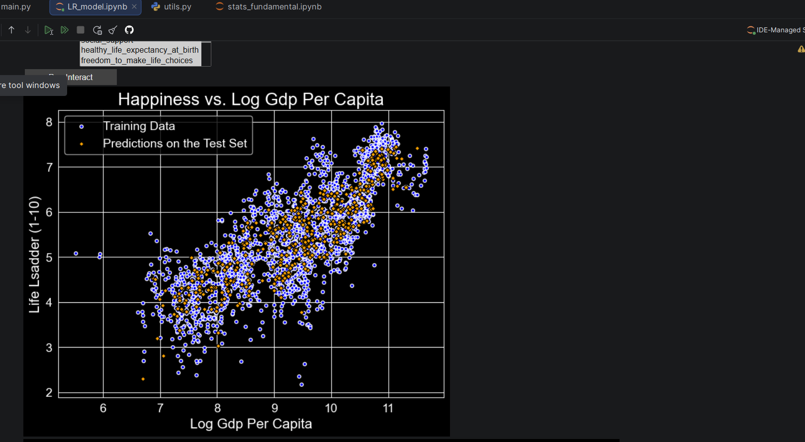
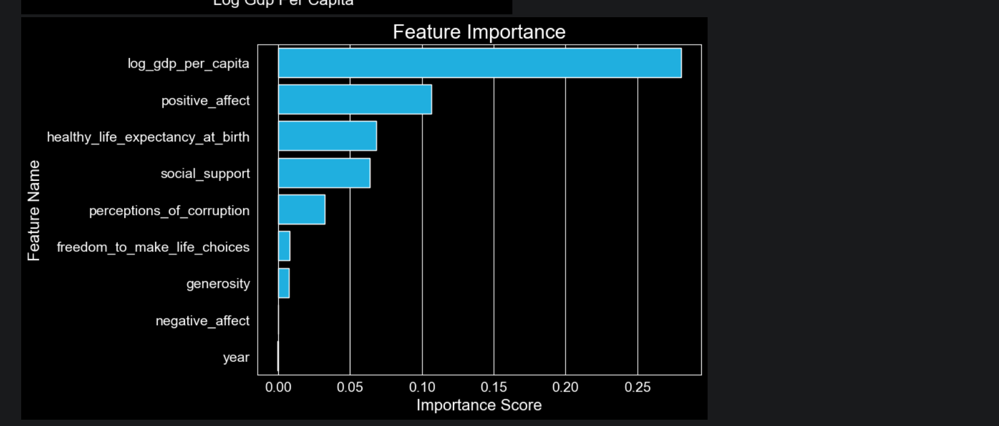

# 🌍 World Happiness Linear Regression Model

A machine learning project that uses **Linear Regression** to predict national happiness scores (Life Ladder) from the World Happiness dataset. The notebook includes interactive feature selection via `ipywidgets`, EDA visualizations, and feature importance analysis.

---

## 📁 Project Structure

```
LR_model.ipynb       # Main notebook
utils.py             # Helper functions (plotting, feature importance)
world_happiness.csv  # Dataset ('data/world_happiness.csv')
README.md
```

---

## 📊 Dataset

**Source:** World Happiness Report  
**File:** `world_happiness.csv`

| Column | Description |
|---|---|
| `country_name` | Country |
| `year` | Year of report |
| `life_ladder` | **Target variable** — happiness score |
| `log_gdp_per_capita` | Log of GDP per capita |
| `social_support` | Perceived social support |
| `healthy_life_expectancy_at_birth` | Healthy life expectancy |
| `freedom_to_make_life_choices` | Freedom index |
| `generosity` | Generosity score |
| `perceptions_of_corruption` | Corruption perception index |
| `positive_affect` | Positive emotion score |
| `negative_affect` | Negative emotion score |

---

## ⚙️ Setup & Installation

### Requirements

```bash
pip install pandas numpy matplotlib seaborn scikit-learn ipywidgets
```

### Clone & Run

```bash
git clone <https://github.com/AsokTamang/stats>
cd <folder where you cloned this repo>
jupyter notebook LR_model.ipynb
```

> **Note:** Update the dataset path in the notebook to match your local environment:
> ```python
> df = pd.read_csv("path/to/world_happiness.csv")
> ```

---

## 🔬 Methodology

### 1. Data Loading & Preprocessing
- Load the CSV and inspect with `df.head()`
- Rename columns to `snake_case` for consistency
- Drop rows with null values using `df.dropna()`

### 2. Exploratory Data Analysis (EDA)
- Correlation heatmap to identify relationships between features
- Distribution plots for key variables

### 3. Model Training
- **Algorithm:** `sklearn.linear_model.LinearRegression`
- **Train/Test Split:** 80% train / 20% test (`random_state=42`)
- **Target:** `life_ladder`
- **Features:** Any subset of the 9 predictor variables (user-selectable)

### 4. Evaluation
- **Metric:** Mean Absolute Error (MAE)
- Feature importance calculated via a custom `utils.calculate_feature_importance()` function
- Most impactful feature highlighted in regression scatter plot

### 5. Interactive Widget
An `ipywidgets` `SelectMultiple` widget lets you choose which features to include in the model at runtime — no code changes needed.

---

## 🖼️ Outputs

- **Scatter plot** of predicted vs. actual happiness scores (along the most important feature axis)
- **Feature importance bar chart** (shown when more than one feature is selected)
- **MAE score** printed to console



  

---

## 📦 `utils.py` Functions Used

| Function | Description |
|---|---|
| `calculate_feature_importance(features, model, X_test, y_test)` | Returns the most important feature and a ranked DataFrame |
| `plot_happiness(feature, X, Y, X_test, y_preds)` | Scatter plot of real vs. predicted values |
| `plot_feature_importance(df)` | Bar chart of feature importances |

---

## 🚀 Usage Example

Run all cells in `LR_model.ipynb`. In the final cell, a widget will appear:

1. **Select** one or more features from the list (hold `Ctrl`/`Cmd` for multi-select)
2. Click **"Run Interact"**
3. View the regression plot, feature importance chart, and MAE score

---

## 📈 Sample Results

With all features selected, the model achieves a low MAE, with `log_gdp_per_capita` and `social_support` typically ranking as the most influential predictors of happiness.

---

## 🧠 Key Takeaways

- GDP per capita and social support are consistently strong predictors of national happiness
- The interactive widget makes it easy to experiment with feature subsets without editing code
- Dropping null values is a simple but effective preprocessing step for this dataset

---
